# 📋 Secretary Kim

Secretary Kim is a premium, feature-rich Discord bot designed to be a personal server assistant. It combines a high-performance **YouTube Music Player** with a state-of-the-art **Gemini-powered Natural Language Event & Task Scheduler**.

Built with modern Python development practices, Secretary Kim is structured using **Clean Architecture** patterns and utilizes **Dependency Injection** (`dependency-injector`) for extreme modularity, robustness, and ease of testing.

---

## 🌟 Key Features

### 🤖 1. AI-Powered Event & Task Scheduling
*   **Natural Language Processing**: Schedule events simply by typing. Execute `/kim <your request>` (e.g., `/kim "Create a mobile UI design task with deadline this Friday and assign it to @Duy"`).
*   **Gemini Integration**: Uses Google's Gemini Pro model (`google-genai`) to parse relative dates/times, recognize assignees from the server member list, and extract specific meeting location preferences.
*   **Smart Voice Channel Mapping**: Automatically matches voice channel names referenced in requests to active voice channels in the server.

### 👥 2. Human-in-the-Loop (HITL) Workflow
*   **Interactive Drafts**: The bot does not immediately create events. Instead, it generates a beautiful draft **Discord Embed** for validation.
*   **Actionable Buttons**:
    *   `✅ Approve`: Instantly schedules the event, creates a Discord Scheduled Event link, and broadcasts an announcement pinging `@everyone`.
    *   `✖️ Reject`: Deletes the draft.
    *   `✏️ Edit`: Opens a native Discord UI Form Modal allowing custom overrides of the event title, description, assignee, scheduled start time (ISO 8601), and location.

### 🎵 3. High-Fidelity Music Streaming
*   **Modern Slash Interface**: Control audio playback via easy-to-use slash commands.
*   **Zero-Disk-Space Streaming**: Streams audio directly from YouTube using `yt-dlp` and `FFmpeg` without downloading files locally.
*   **Smart Link Refreshing**: Automatically refreshes YouTube streaming links right before playing to avoid expired stream URLs.
*   **Multi-Guild Support**: Features server-isolated queues so multiple Discord servers can play different songs concurrently.
*   **Loop Mode**: Toggle repetition for the currently playing track.

### 🏆 4. Attendance Coin Earning & Leaderboard
*   **Voice Presence Tracking**: Automatically scans voice channels every 60 seconds to reward active users.
*   **Coin Economy**: Earn **1 Attendance Coin** for every minute active in voice channels.
*   **Fair Play Rules**: User must be in a voice channel with at least 1 other non-bot member, and cannot be muted (self/server) or deafened (self/server).
*   **Persistent Leaderboard**: Automatically posts and updates a pinned leaderboard in the designated channel (`LEADERBOARD_CHANNEL_ID`), displaying the top 10 users sorted by total Coins. Employs MD5 hashing of content state to only trigger edits when data changes, avoiding Discord rate limits.

### 👾 5. Procedural Pokémon Gacha & Pomodoro Focus
*   **Gemini-Designed Companions**: Roll for completely unique Pokémon companions. Uses Gemini to procedurally design the pet's name, element types (from 18 categories), lore, and visual prompts based on rarity and concepts (across 19 themes).
*   **AI-Generated Pixel Art**: Uses Cloudflare AI (PixelLab Service) to dynamically render high-quality custom transparent pixel-art images for each pet.
*   **Pet Feeding & XP**: Spend **20 Coins** to feed your active pet, healing **20 HP** and granting **15-30 XP**.
*   **Multistage Evolutions**: Common and Epic rarity pets can evolve into Stage 2 (Level 5), Stage 3 (Level 15), and a 20% chance of a Stage 4 Mega Evolution (Level 30), automatically generating newly evolved pixel art. Legendary and God rarity pets do not evolve and remain in their majestic single stage.
*   **Pomodoro Focus**: Start Pomodoro focus sessions (default 25 minutes) directly with `/pomodoro-start` or via AI commands to level up focus habits while keeping your pet active.

---

## ⚙️ How the AI Scheduling Works

```mermaid
sequenceDiagram
    actor User as User (Discord)
    participant Bot as Secretary Kim
    participant Gemini as Gemini AI
    participant Admin as User/Admin

    User->>Bot: Slash Command: /kim "Create design meeting tomorrow at 3pm with @Duy in Meeting Room"
    Bot->>Bot: Gather server members list & active voice channels
    Bot->>Gemini: Send request text + members & channels mapping + current time context
    Gemini-->>Bot: Returns structured ProposedAction JSON
    Bot->>User: Displays Interactive Draft Embed (Approve / Reject / Edit)

    rect rgb(40, 44, 52)
        Note over Admin, Bot: Human-in-the-Loop Approval
        Admin->>Bot: Optional: Click "Edit" -> Fills Modal form -> Update draft
        Admin->>Bot: Click "Approve"
    end

    Bot->>Bot: Verify event timeframe (must be future time)
    Bot->>User: Creates Discord Guild Scheduled Event
    Bot->>User: Sends announcement to channel with @everyone ping
```



---

## 🏛️ Clean Architecture Design

The project is structured according to **Clean Architecture** guidelines to separate business logic, user interfaces, and infrastructure dependencies:

```
├── app/
│   ├── core/                  # Core modules (Configuration, Logging, DI Container)
│   │   ├── config.py          # Environment settings using Pydantic Settings
│   │   ├── container.py       # Dependency Injection container
│   │   └── logger.py          # Application-wide logging
│   ├── domain/                # Enterprise & business rules (pure Python logic)
│   │   ├── models/            # Domain entities (e.g. ProposedAction model)
│   │   └── interfaces/        # Interfaces/abstractions
│   ├── services/              # Application business rules
│   │   ├── agent/             # AI Agent services (Event parsing, Task management)
│   │   └── music.py           # Core logic for yt-dlp extracting & stream preparation
│   ├── presentation/          # User Interface adapters (Discord Bot, Cogs, Modals, Views)
│   │   ├── discord_bot.py     # Main Bot client & MusicCog
│   │   └── event_cog.py       # EventCog handling interactive drafts, modals & buttons
│   └── main.py                # App entrypoint
├── Dockerfile                 # Multi-stage container builds
├── pyproject.toml             # uv/Python package configurations
└── main.py                    # Root execution hook
```

---

## 📋 Commands Reference

### AI Assistant & Help Commands
| Command | Description | Arguments |
|:---|:---|:---|
| `/help` | Show all available slash commands of Secretary Kim with interactive pagination. | *None* |
| `/kim` | Requests the AI to schedule an event or task from your natural language input. | `request` (Text prompt, e.g. details, date/time, assignee, room) |

### Music Player Commands
| Command | Description | Arguments |
|:---|:---|:---|
| `/play` | Play a song or add it to the queue | `query` (YouTube URL or search keywords) |
| `/pause` | Pause current playback | *None* |
| `/resume` | Resume playback | *None* |
| `/skip` | Skip the current playing song | *None* |
| `/queue` | Display the current server queue list | *None* |
| `/loop` | Toggle looping for the current song | *None* |
| `/stop` | Stop playback and clear the queue | *None* |
| `/leave` | Disconnect the bot from the voice channel and clear queue | *None* |

### Gacha & Pomodoro Commands
| Command | Description | Arguments |
|:---|:---|:---|
| `/gacha` | Roll a new procedural Pokemon companion. | *None* (Costs 100 Coins) |
| `/pet-active` | View stats, HP, level, and image of your active pet companion. | *None* |
| `/pet-list` | Display a list of all your pets with an interactive dropdown to switch active companion. | *None* |
| `/feed` | Feed Fruits to your active pet to heal HP, earn XP, and trigger evolutions. | `amount` (Number of times / fruits to feed, default 1) |
| `/pomodoro-start` | Start a Pomodoro focus session in your current voice channel. | `duration` (Focus duration in minutes, default 25) |
| `/pomodoro-cancel` | Cancel your active Pomodoro focus session. | *None* |

---

## 🚀 Getting Started

### Prerequisites
1.  **Python**: Ensure you have Python 3.13 or newer installed.
2.  **uv**: Astral's package manager is used to manage virtual environments and dependencies.
3.  **FFmpeg**: Required on the host machine for processing audio streams locally (packaged automatically in Docker).

### Configuration
1.  Duplicate the environment template file:
    ```bash
    cp .env.example .env
    ```
2.  Open the newly created `.env` file and populate it with your keys:
    ```env
    GEMINI_API_KEY=your_gemini_api_key
    DISCORD_BOT_TOKEN=your_discord_bot_token
    GACHA_IMAGE_CHANNEL_ID=your_gacha_image_channel_id
    LEADERBOARD_CHANNEL_ID=your_leaderboard_channel_id
    PIXELLAB_API_KEY=your_pixellab_api_key

    # Optional settings with default values:
    # GEMINI_PRIMARY_MODEL=gemini-3.1-flash-lite
    # GEMINI_FALLBACK_MODEL=gemini-3.5-flash

    # Firebase Realtime Database:
    FIREBASE_DATABASE_URL=https://your-project-default-rtdb.asia-southeast1.firebasedatabase.app/
    FIREBASE_CREDENTIALS_PATH=data/firebase-key.json
    # OR configure via JSON string:
    # FIREBASE_CREDENTIALS_JSON='{...}'
    ```

#### Discord Developer Portal Setup
Under the [Discord Developer Portal](https://discord.com/developers/applications):
1.  Go to your Application -> **Bot** -> **Privileged Gateway Intents** and enable:
    *   **Presence Intent**
    *   **Server Members Intent** (Crucial for AI Agent member mapping)
    *   **Message Content Intent**
2.  Go to **OAuth2** -> **URL Generator**, select the following scopes and permissions, and use the generated URL to invite the bot:
    *   **Scopes**: `bot`, `applications.commands`
    *   **Bot Permissions**: `Connect`, `Speak`, `Send Messages`, `Embed Links`, `Manage Events` (Crucial for scheduled events creation)

---

## 📦 Deployment Options

### Method A: Running with Docker (Recommended)
Docker is the cleanest deployment route as it automatically configures the correct Python environment and compiles system-level **FFmpeg** binaries.

end2end
```bash
docker build -t secretary-kim-bot .
docker stop secretary-kim && docker rm secretary-kim
docker run -d --name secretary-kim --env-file .env --restart unless-stopped secretary-kim-bot
```

1.  **Build the image:**
    ```bash
    docker build -t secretary-kim-bot .
    ```

2.  **Start the container:**
    ```bash
    docker run -d \
      --name secretary-kim \
      --env-file .env \
      --restart unless-stopped \
      secretary-kim-bot
    ```

3.  **Check status and logs:**
    ```bash
    docker logs -f secretary-kim
    ```

4.  **Stop the bot:**
    ```bash
    docker stop secretary-kim
    docker rm secretary-kim
    ```

---

### Method B: Running Locally

1.  **Install FFmpeg on your host machine:**
    *   **Ubuntu/Debian**: `sudo apt update && sudo apt install ffmpeg`
    *   **macOS** (via Homebrew): `brew install ffmpeg`
    *   **Windows** (via Scoop): `scoop install ffmpeg`

2.  **Sync dependencies and virtual environment:**
    Using `uv`, download and synchronize all requirements automatically:
    ```bash
    uv sync
    ```

3.  **Start the bot:**
    Run the entrypoint through `uv`'s environment manager:
    ```bash
    uv run python main.py
    ```

---

## 🛠️ Development & Commit Process

This project uses **`pre-commit`** hooks to maintain code quality, consistency, and a clean Git history. The hooks perform the following automated checks on every commit:
*   **Code Formatting**: Formats Python code using `ruff format`.
*   **Linting**: Lints Python files and applies auto-fixes using `ruff-check`.
*   **Lockfile Sync**: Ensures `uv.lock` is up-to-date with `pyproject.toml` using `uv-lock`.
*   **Sanity Checks**: Verifies YAML syntax, removes trailing whitespace, and fixes end-of-file formatting.

### Setup pre-commit Hooks

Ensure you have run `uv sync` to install `pre-commit` into your local virtual environment:

1.  **Install Git Hooks:**
    ```bash
    source .venv/bin/activate
    pre-commit install
    ```
    *Alternatively, you can run directly with `uv run`:*
    ```bash
    uv run pre-commit install
    ```

2.  **Run checks manually (Optional):**
    To scan all files and verify formatting or lockfile alignment without committing:
    ```bash
    uv run pre-commit run --all-files
    ```

When you run `git commit`, the hooks will run automatically. If a hook formats a file or updates the lockfile, the commit will be rejected. Simply stage the updated changes (`git add <file>`) and run `git commit` again.

---

## 🛠️ Built With
*   [discord.py](https://github.com/Rapptz/discord.py) - Modern, async API wrapper for Discord in Python.
*   [google-genai](https://github.com/google/generative-ai-python) - Google's official Python SDK for the Gemini API.
*   [dependency-injector](https://github.com/ets-labs/python-dependency-injector) - Dependency injection framework for Python.
*   [pydantic-settings](https://github.com/pydantic/pydantic-settings) - Configuration management using Pydantic.
*   [yt-dlp](https://github.com/yt-dlp/yt-dlp) - YouTube audio and video extraction utility.
*   [uv](https://github.com/astral-sh/uv) - Ultra-fast Python package installer and resolver.
